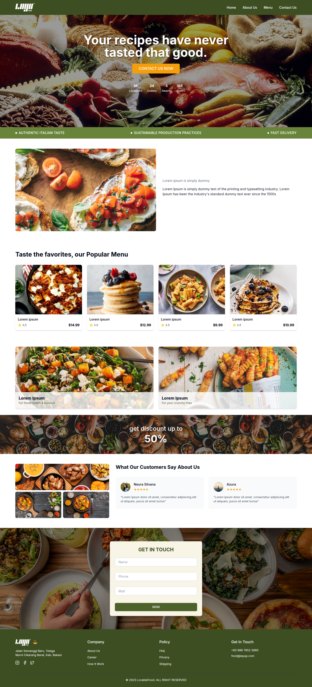
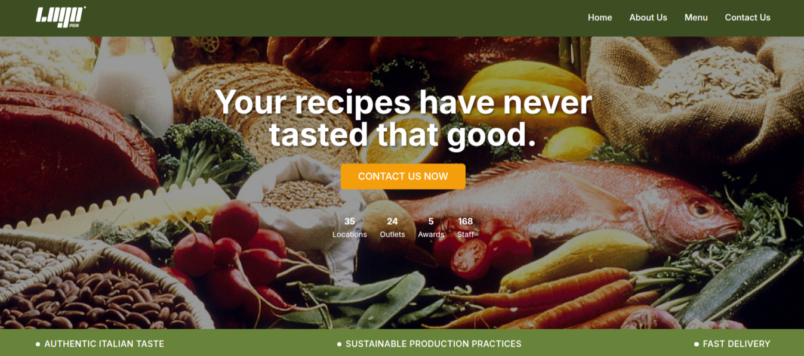
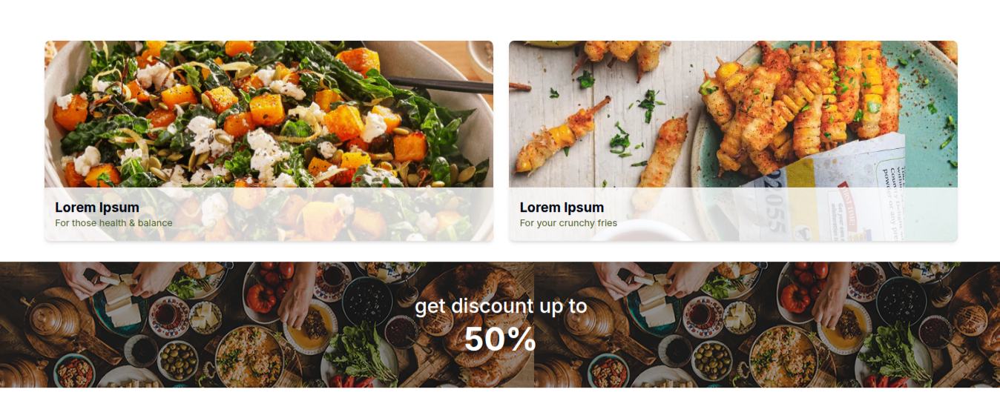
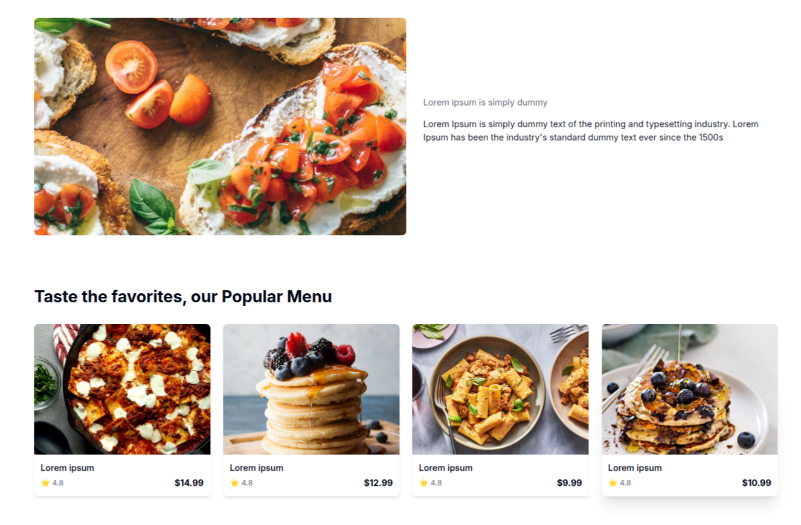
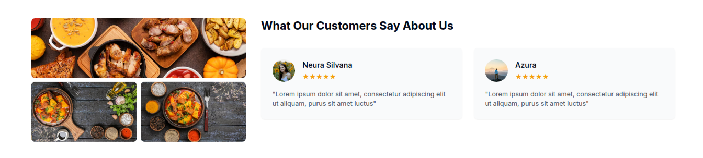
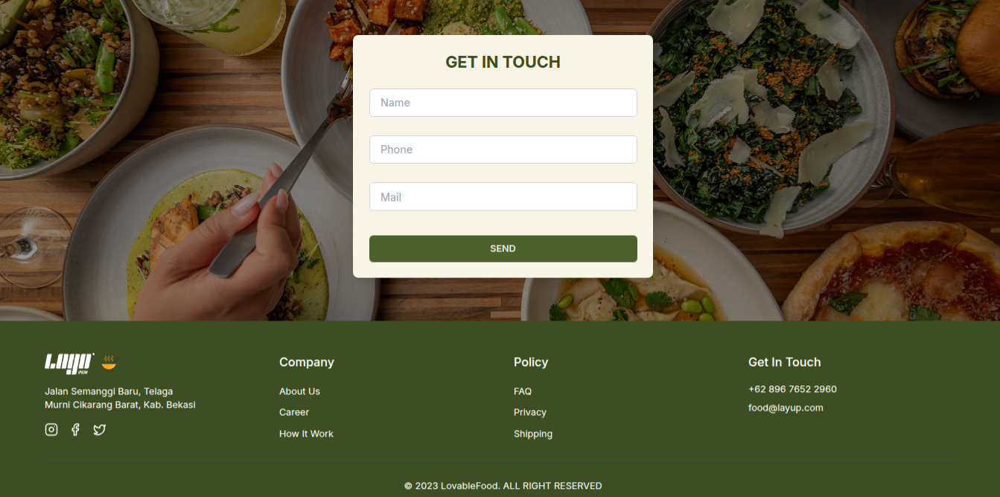

# Elegant Restaurant Landing Page

A sophisticated, modern landing page built with React, TypeScript, and Tailwind CSS for an upscale restaurant. This application showcases culinary excellence through an elegant design and interactive features.

## Project Overview

This landing page leverages modern web technologies to create an immersive dining experience. Built with Vite, React, TypeScript, and shadcn-ui components, it features smooth animations, responsive design, and a carefully crafted user interface that highlights the restaurant's offerings.

## Features

- Modern responsive design (Mobile, Tablet, Desktop)
- Interactive menu showcase
- Animated components with smooth transitions
- Testimonials carousel
- Online reservation system
- Special offers and discounts section
- Real-time table booking
- Performance optimized image loading

## Screenshots

### Complete Landing Page

*Comprehensive view of the restaurant landing page showcasing elegant design and culinary excellence*

### Hero Section

*Striking hero section featuring signature dishes and ambiance with compelling call-to-action*

### Featured Dishes & Discount

*Showcase of chef's special dishes and current promotional offers*

### Main Dish Menu

*Interactive menu presentation with detailed dish descriptions*

### Testimonials

*Customer reviews and testimonials with profile images*

### Contact & Footer

*Reservation form and comprehensive footer with restaurant information*

## Project Structure

```
src/
├── components/
│   ├── ui/               # shadcn-ui components
│   ├── Navbar.tsx        # Navigation menu
│   ├── Hero.tsx         # Main showcase
│   ├── Features.tsx     # Restaurant features
│   ├── FeaturedDish.tsx # Special dishes
│   ├── PopularMenu.tsx  # Menu items
│   ├── Discount.tsx     # Special offers
│   ├── Testimonials.tsx # Customer reviews
│   ├── ContactForm.tsx  # Reservation form
│   └── Footer.tsx       # Site footer
├── assets/
│   ├── hero-background.png
│   ├── main-dish.jpg
│   ├── discount-background.png
│   ├── contact-background.png
│   ├── first-dish.png
│   └── [other images]...
├── hooks/
│   ├── use-mobile.tsx
│   └── use-toast.ts
├── lib/
│   └── utils.ts
└── pages/
    ├── Index.tsx
    └── NotFound.tsx
```

## Technology Stack

- Vite
- React 18
- TypeScript
- Tailwind CSS
- shadcn-ui Components
- React Hooks
- Modern JavaScript

## Color Scheme

- Primary: #D4B996 (Golden Brown)
- Secondary: #C1A173 (Warm Tan)
- Accent: #E6CCB2 (Light Beige)
- Background: #F7E6D4 (Soft Cream)
- Text: #2C1810 (Deep Brown)

## Getting Started

1. Clone the repository
```bash
git clone [repository-url]
```

2. Install dependencies
```bash
npm install
```

3. Start development server
```bash
npm run dev
```

## Customization

### Images
- Replace images in `src/assets/`
- Menu images: `first-dish.png` through `forth-dish.png`
- Background images: `hero-background.png`, `discount-background.png`
- Testimonial images: `person-one.jpg`, `person-two.jpg`

### Components
- UI components in `src/components/ui/`
- Main components in `src/components/`
- Page layouts in `src/pages/`

### Styling
- Tailwind configuration in `tailwind.config.ts`
- Global styles in `src/index.css`
- Component-specific styles in respective files

## Build & Deployment

```bash
# Build for production
npm run build

# Preview production build
npm run preview
```

## Performance Features

- Image optimization
- Lazy loading components
- Route-based code splitting
- Optimized asset delivery
- Responsive image loading
- Modern build tooling

## Browser Support

- Chrome (latest)
- Firefox (latest)
- Safari (latest)
- Edge (latest)

## Contributing

1. Fork the repository
2. Create your feature branch
3. Commit your changes
4. Push to the branch
5. Create a new Pull Request

## License

[MIT License](LICENSE)

## Contact

For any queries or support, please open an issue in the repository.
